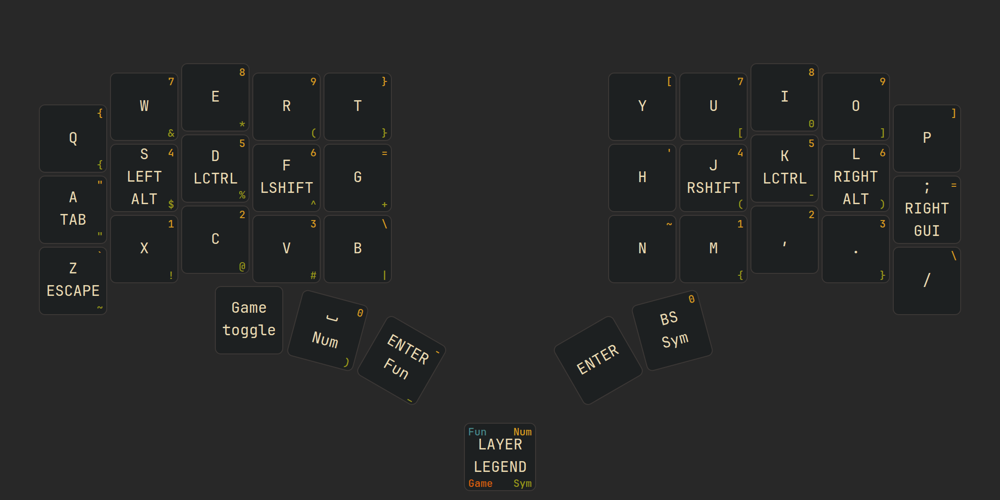

## Intro

This repository contains a ZMK firmware configuration for a wireless otello setup with dongle support and trackball features.

Based on [280Zo/otello-wireless-mini-zmk-firmware](https://github.com/280Zo/otello-wireless-mini-zmk-firmware).

The project is currently organized around one source keymap file:

- [config/otello.keymap](config/otello.keymap)

## Overview

<picture>
  <source media="(prefers-color-scheme: dark)" srcset="keymap-drawer/stacked/stacked-combos-dark.png">
  <source media="(prefers-color-scheme: light)" srcset="keymap-drawer/stacked/stacked-combos-light.png">
  
</picture>

For all layers in one image, see [keymap-drawer/all_layers/all_layers.svg](keymap-drawer/all_layers/all_layers.svg).

## Current Layers

| # | Layer   | Purpose |
| - | ------- | ------- |
| 0 | BASE    | Main typing layer with homerow mods |
| 1 | NUM     | Numbers and numpad-style entries |
| 2 | SYM     | Symbols and punctuation helpers |
| 3 | FUN     | Media/system/function keys |
| 4 | POINTER | Auto-activated by trackball movement (200 ms timeout) |
| 5 | SLOW    | Reduced-speed pointer layer (hold `mo 5` from POINTER) |
| 6 | SCROLL  | Scroll-oriented layer (hold `mo 6` from POINTER) |
| 7 | GAME    | Simplified gaming layer (toggle with `tog 7`); takes priority over POINTER |

### Layer Activation

- **POINTER (4)**: Automatically activates on any trackball movement and deactivates 200 ms after movement stops.
- **SLOW (5)**: Hold dedicated key on the home row while in POINTER layer.
- **SCROLL (6)**: Hold dedicated key on the home row while in POINTER layer.
- **GAME (7)**: Toggled with the leftmost thumb key. Because layer 7 has higher priority than POINTER (4), trackball movement does not interrupt the game layout.

### Homerow Mods (BASE)

| Key | Tap | Hold |
| --- | --- | ---- |
| A   | A   | Tab |
| S   | S   | Left Alt |
| D   | D   | Left Ctrl |
| F   | F   | Left Shift |
| J   | J   | Right Shift |
| K   | K   | Left Ctrl |
| L   | L   | Right Alt |
| ;   | ;   | Right GUI |
| Z   | Z   | Escape |

Tapping term: 160 ms · Quick-tap: 140 ms · Flavor: tap-preferred

## Behaviors and Macros

Combos are currently disabled in this keymap setup.

Custom behaviors and mod-morph/hold-tap logic live in:

- [config/keymap_features/behaviors.dtsi](config/keymap_features/behaviors.dtsi)
- [config/keymap_features/macros.dtsi](config/keymap_features/macros.dtsi)

## Customize

### Edit Keymap

Edit [config/otello.keymap](config/otello.keymap), then rebuild.

### Edit Features

Edit any of these, then rebuild:

- [config/keymap_features/behaviors.dtsi](config/keymap_features/behaviors.dtsi)
- [config/keymap_features/combos.dtsi](config/keymap_features/combos.dtsi)
- [config/keymap_features/macros.dtsi](config/keymap_features/macros.dtsi)

### Edit Trackball Behavior

Trackball/input processor settings are in [config/trackball/otello_pointer.dtsi](config/trackball/otello_pointer.dtsi).

## Credits

- [280Zo](https://github.com/280Zo/otello-wireless-mini-zmk-firmware) for the original repository this was based on
- [badjeff](https://github.com/badjeff) for PMW3610 driver work used as the basis for the trackball integration
- [eigatech](https://github.com/eigatech) for reference patterns around split/dongle otello setups
- [nickcoutsos](https://github.com/nickcoutsos/keymap-editor) for the keymap-editor workflow
- [caksoylar](https://github.com/caksoylar/keymap-drawer) for keymap rendering tooling
